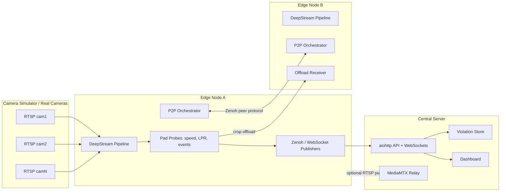
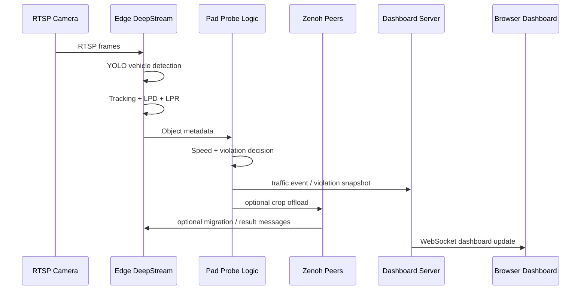
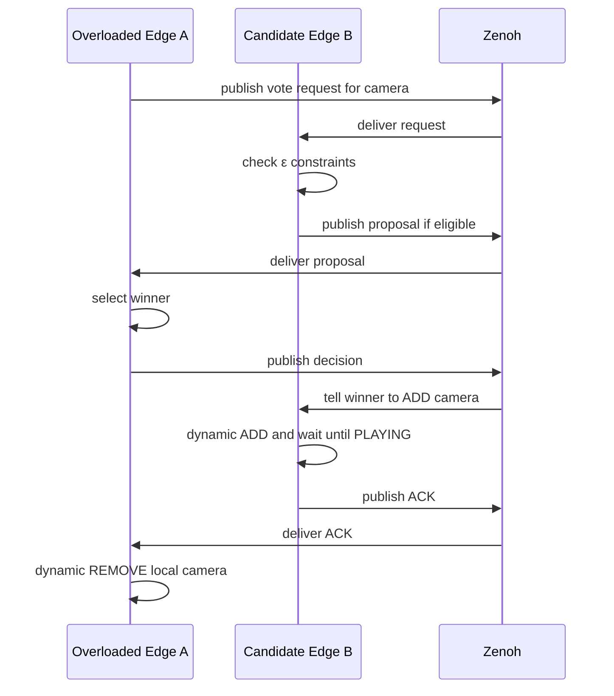

# IoT Graduate — Distributed Edge Traffic Monitoring

IoT Graduate is an experimental distributed traffic-monitoring system built for Jetson-class edge devices. It combines NVIDIA DeepStream video analytics, TensorRT inference, RTSP camera simulation, Zenoh peer-to-peer coordination, and an aiohttp dashboard server.

The project detects vehicles, tracks them across calibrated road regions, estimates speed, recognizes license plates, records violations, and can redistribute camera workloads between edge nodes when one node becomes overloaded.

> Status: research / experimental prototype. The repository intentionally keeps several lab conveniences such as local `.env` files, generated engines, and simple open network endpoints. Treat it as a trusted-LAN system unless hardening is added.

---

## Table of Contents

- [System Overview](#system-overview)
- [Repository Layout](#repository-layout)
- [Main Runtime Flow](#main-runtime-flow)
- [Edge Node](#edge-node)
  - [Entry Points](#edge-entry-points)
  - [DeepStream Pipeline](#deepstream-pipeline)
  - [Camera Configuration](#camera-configuration)
  - [Speed Estimation](#speed-estimation)
  - [License Plate Detection and Recognition](#license-plate-detection-and-recognition)
  - [Dynamic Camera Add / Remove](#dynamic-camera-add--remove)
  - [Output Modes](#output-modes)
  - [Native C++ Extension Layer](#native-c-extension-layer)
  - [Load Model](#load-model)
  - [P2P Orchestration](#p2p-orchestration)
  - [Crop Offload](#crop-offload)
  - [Monitoring and Health](#monitoring-and-health)
- [Server](#server)
- [Camera Simulator](#camera-simulator)
- [Configuration Reference](#configuration-reference)
- [Models and TensorRT Engines](#models-and-tensorrt-engines)
- [Tools and Tests](#tools-and-tests)
- [Runbook](#runbook)
- [Data Formats](#data-formats)
- [Known Limitations and Risks](#known-limitations-and-risks)
- [Recommended Next Steps](#recommended-next-steps)

---

## System Overview

At a high level, the system has three deployable parts:

1. **Camera simulator (`Camera/`)**
   - Runs MediaMTX and FFmpeg-based camera containers.
   - Converts local video files into RTSP streams such as `rtsp://host:8554/cam1`.

2. **Edge node (`Edge/`)**
   - Runs the DeepStream inference pipeline on Jetson hardware.
   - Consumes RTSP cameras or video files.
   - Detects vehicles, license plates, recognized plate text, speed, and violations.
   - Publishes events to the central server.
   - Exchanges peer status, votes, migration commands, and offload payloads over Zenoh.

3. **Server (`Server/`)**
   - Runs an aiohttp web application and WebSocket endpoints.
   - Receives edge events and snapshots.
   - Stores violations on disk.
   - Serves the browser dashboard from `Server/static/index.html`.
   - Can run its own MediaMTX relay for centralized RTSP viewing.

### Logical Architecture



---

## Repository Layout

```text
IoT_Graduate/
├── Camera/
│   ├── Dockerfile
│   ├── docker-compose.yml
│   ├── generate-compose.sh
│   ├── ground_truth.csv
│   ├── mediamtx.yml
│   ├── sim_cameras.yml
│   ├── start.sh
│   └── videos/
├── Edge/
│   ├── main.py
│   ├── health_agent.py
│   ├── run_edge.sh
│   ├── setup_system.sh
│   ├── speed_gui.py
│   ├── requirements.txt
│   ├── configs/
│   ├── models/
│   ├── speedflow_cpp/
│   ├── speedflow_python/
│   ├── tests/
│   └── tools/
├── Server/
│   ├── app.py
│   ├── edge_registry.py
│   ├── violation_store.py
│   ├── docker-compose.media.yml
│   ├── mediamtx.yml
│   ├── requirements.txt
│   ├── static/
│   └── violations/
├── .gitignore
└── README.md
```

### Directory Responsibilities

| Path | Purpose |
| --- | --- |
| `Camera/` | Local RTSP camera simulation using Docker, MediaMTX, FFmpeg, and local videos. |
| `Edge/` | Jetson-side runtime: DeepStream inference, tracking, speed estimation, event publishing, and peer orchestration. |
| `Edge/configs/` | DeepStream inference configs, tracker configs, analytics configs, camera definitions, labels, and P2P tuning. |
| `Edge/models/` | TensorRT engine artifacts and build script. |
| `Edge/speedflow_cpp/` | C++ speed/geometry/image-enhancement implementation exposed to Python as `speedflow_cpp.so`. |
| `Edge/speedflow_python/` | Main Python backend package. |
| `Edge/tools/` | Profiling, calibration, plotting, and coefficient fitting utilities. |
| `Edge/tests/` | Unit tests for the load model. |
| `Server/` | Dashboard backend, violation storage, edge registry, and central MediaMTX compose file. |

---

## Main Runtime Flow

The normal end-to-end flow is:

1. Camera sources are defined in `Edge/configs/cameras.yml` or passed with `--source`.
2. `Edge/main.py` starts the selected output mode.
3. `speedflow_python/run_python.py` loads settings and builds the DeepStream graph.
4. `core_pipeline.py` creates the GStreamer pipeline:
   - source bins
   - `nvstreammux`
   - primary detector
   - tracker
   - secondary license-plate detector
   - secondary license-plate recognizer
   - analytics / OSD / output sink
5. `probes.py` receives metadata from pad probes.
6. Tracking, speed estimation, LPR text extraction, snapshots, and violation decisions are computed.
7. Events are published to the server and/or peers.
8. Server stores violations and pushes updates to the dashboard.
9. Peer orchestrators monitor load and can offload crop-level inference or migrate whole camera streams.



---

## Edge Node

The Edge node is the main computation unit. It is designed for Jetson Orin-class hardware with NVIDIA DeepStream, TensorRT, GStreamer, CUDA, and Python bindings.

### Edge Entry Points

| File | Role |
| --- | --- |
| `Edge/main.py` | CLI entry point. Selects `display`, `file`, or `rtsp_push` mode. |
| `Edge/run_edge.sh` | Convenience launcher script. |
| `Edge/setup_system.sh` | Experimental provisioning script that rewrites local configuration. Review before use. |
| `Edge/health_agent.py` | Publishes Jetson hardware health metrics. |
| `Edge/speed_gui.py` | GUI-oriented entry point / helper for speed monitoring. |

Run from the `Edge/` directory:

```bash
python3 main.py --mode display
python3 main.py --mode file --output output/result.mp4
python3 main.py --mode rtsp_push
python3 main.py --mode rtsp_push --rtsp-push-url rtsp://server:8554/jetson_A
```

### DeepStream Pipeline

Main file: `Edge/speedflow_python/core_pipeline.py`

The pipeline is built around NVIDIA DeepStream and GStreamer. Its core stages are:

1. **Input source bins**
   - Created from RTSP URLs or file paths.
   - Each camera maps to a DeepStream source ID.

2. **`nvstreammux`**
   - Batches multiple camera streams into one inference batch.
   - Uses configured mux width and height.

3. **Primary detector (PGIE)**
   - Config: `Edge/configs/config_infer_primary_yolo11.txt`
   - Labels: `Edge/configs/labels_YOLO.txt`
   - Detects traffic objects, mainly vehicles.

4. **Tracker**
   - Configs include:
     - `config_tracker_lpd.yml`
     - `config_tracker_NvDCF_perf.yml`
   - Maintains object identity across frames so speed can be estimated over time.

5. **Secondary license plate detector (LPD)**
   - Config: `config_infer_secondary_lpd.txt`
   - Labels: `labels_lpd.txt`
   - Locates plate regions inside vehicle crops.

6. **Secondary license plate recognizer (LPR)**
   - Config: `config_infer_secondary_lpr.txt`
   - Labels: `labels_lpr.txt`
   - Uses a custom parser in `configs/nvinfer_custom_lpr_parser/`.

7. **Analytics / OSD / sink**
   - Analytics config: `config_nvdsanalytics.txt`
   - Output sink depends on selected mode:
     - display window
     - MP4 file output
     - RTSP push

### Camera Configuration

Main file: `Edge/configs/cameras.yml`

Each camera entry contains:

| Field | Meaning |
| --- | --- |
| `camera_id` | Stable logical camera name, e.g. `cam_01`. |
| `source_id` | Numeric DeepStream source ID. Must be unique per active pipeline. |
| `uri` | RTSP URL or local file path. |
| `enabled` | Whether the stream should be active. |
| `name` | Human-readable display name. |
| `fps` | Expected frame rate. |
| `speed_limit_kmh` | Violation threshold. |
| `homography.source_points` | Four source image points used to map image coordinates to road-plane coordinates. |
| `homography.target_width` / `target_height` | Real-world calibration dimensions. |
| `roi_polygon` | Region of interest in mux-resolution pixel coordinates. |
| `output.record` | Whether this camera should be recorded in file mode. |
| `output.record_path` | Per-camera recording destination. |

The comments in `cameras.yml` indicate coordinates are currently defined at mux resolution `1280x720`. If mux dimensions change, homography and ROI points must be scaled.

### Speed Estimation

Speed logic combines object tracking and camera calibration:

- Each vehicle receives a persistent tracker ID.
- Its image position is projected through the camera homography.
- Movement over time gives estimated real-world speed.
- ROI filtering avoids estimating outside the configured road region.
- Median filtering and native helpers smooth noisy estimates.

Relevant files:

| File | Purpose |
| --- | --- |
| `speedflow_python/probes.py` | Reads DeepStream metadata and updates per-object speed state. |
| `speedflow_python/analytics.py` | Analytics helpers and violation-related calculations. |
| `speedflow_python/speedflow_c.py` | Python wrapper around native C++ helpers with Python fallback behavior. |
| `speedflow_cpp/speedflow.cpp` | Native speed / geometry implementation. |
| `speedflow_cpp/speedflow.h` | Native declarations. |

### License Plate Detection and Recognition

The license plate path has two levels:

1. **LPD** — locate the plate region.
2. **LPR** — classify character sequence from the plate crop.

Relevant files:

| File | Purpose |
| --- | --- |
| `configs/config_infer_secondary_lpd.txt` | Secondary detector config for license plate detection. |
| `configs/config_infer_secondary_lpr.txt` | Secondary classifier config for plate recognition. |
| `configs/labels_lpd.txt` | LPD labels. |
| `configs/labels_lpr.txt` | LPR character labels. |
| `configs/nvinfer_custom_lpr_parser/nvdsinfer_custom_impl_lpr.cpp` | Custom DeepStream parser for LPR classifier output. |
| `configs/nvinfer_custom_lpr_parser/nvinfer_custom_lpr_parser.cpp` | Parser integration source. |
| `speedflow_python/plate_preprocessor.py` | Plate crop preprocessing utilities. |

The LPR custom parser now uses relative label lookup candidates and validates tensor dimensionality before indexing output shapes.

### Dynamic Camera Add / Remove

The project supports runtime camera changes:

- Local edits to `configs/cameras.yml` can enable or disable cameras.
- Zenoh control messages can request `ADD`, `REMOVE`, and `STATUS` actions.
- P2P migration uses dynamic add/remove as the mechanism for full stream movement.

Relevant files:

| File | Purpose |
| --- | --- |
| `speedflow_python/camera_config.py` | Parses and watches camera YAML configuration. |
| `speedflow_python/core_pipeline.py` | Implements dynamic source-bin creation, streammux linking, and cleanup. |
| `speedflow_python/zenoh_subscriber.py` | Receives remote camera-control messages. |
| `speedflow_python/peer_orchestrator.py` | Uses dynamic add/remove for peer migration and reclaim. |

Dynamic ADD now also creates the per-camera recording branch in file mode when `record: true` is set and the pipeline has a demux branch available. Dynamic REMOVE tears down that recording branch too.

### Output Modes

The Edge runtime supports three modes through `main.py`:

| Mode | Command | Purpose |
| --- | --- | --- |
| `display` | `python3 main.py --mode display` | Show tiled live output on screen. |
| `file` | `python3 main.py --mode file --output output/result.mp4` | Write pipeline output to MP4; camera-level recording can also be enabled in `cameras.yml`. |
| `rtsp_push` | `python3 main.py --mode rtsp_push` | Push processed stream to a central RTSP endpoint. |

### Native C++ Extension Layer

Native implementation lives in `Edge/speedflow_cpp/`.

| File | Purpose |
| --- | --- |
| `speedflow.cpp` | Core native implementation for geometry, speed estimation helpers, ROI, and smoothing. |
| `speedflow.h` | Header for native functions. |
| `plate_enhance.cpp` | Native image-enhancement support for plate crops. |

Python uses this through `speedflow_python/speedflow_c.py`. The wrapper is designed to fall back to Python implementations if the compiled `.so` is unavailable, which keeps development and tests possible on non-Jetson systems.

### Load Model

The load model estimates when an edge node is under pressure and should offload work.

Relevant files:

| File | Purpose |
| --- | --- |
| `speedflow_python/load_model.py` | Hardware load scoring, proactive model, thermal fuse, and risk index. |
| `configs/edge_node.yml` | P2P, load-score, and proactive model configuration. |
| `tests/test_load_model.py` | Unit tests for load-model behavior. |

The proactive model combines:

- **CV-plane workload estimate (`L_proactive`)**
  - Base workload `W_base`.
  - Number of tracked vehicles.
  - Quadratic vehicle term if needed.
  - Number of plates.
  - Stationary fraction.

- **Hardware safety fuse (`H_reactive`)**
  - GPU, CPU, RAM, thermal pressure.

- **Noisy-OR fusion**
  - Combines proactive and reactive signals into a unified risk index.

Simplified formula from `edge_node.yml` comments:

```text
L = (W_base + Σ_cam[α₁·N_track + α₂·N_track² + β·N_plate + γ·S]) / 100
H = max(R_GPU, R_CPU, R_RAM) × Θ_thermal
U = 1 - (1 - L̂_avg)(1 - Ĥ_avg)
```

Where `U` is the smoothed risk index used to trigger offload escalation when proactive mode is enabled.

### P2P Orchestration

Main file: `Edge/speedflow_python/peer_orchestrator.py`

The system has a decentralized load-balancing protocol over Zenoh. There is no single leader for normal migration decisions.

Key concepts:

| Concept | Meaning |
| --- | --- |
| Peer status | Each node publishes health/load/camera ownership. |
| RFO / RFQ-style vote | An overloaded node asks peers who can accept a camera. |
| ε-constraint bidding | A peer only bids if it passes capacity, FPS, network, cooldown, and penalty checks. |
| F(x) score | Bid ranking based on current load and available capacity. |
| Make-before-Break | Receiver starts the stream first; requester removes its local stream only after ACK. |
| Penalty cooldown | A peer that times out during migration is temporarily penalized. |
| Reclaim | A node can take back migrated cameras after sustained recovery. |
| Leaderless failover | Surviving peers use consistent hashing to decide who rescues cameras from an offline node. |

#### Migration Flow



#### ε-Constraint Checks

Before a peer can accept a camera it evaluates:

1. **Capacity** — future active stream count must not exceed `eps_streams_max`.
2. **FPS prediction** — configured `fps_model` must remain above the threshold for the tier.
3. **Network reachability** — camera RTSP source must be reachable within the tier network budget.
4. **Camera cooldown** — recently migrated cameras are not immediately moved again.
5. **Penalty state** — peers that recently failed a migration can be temporarily avoided.

### Crop Offload

Main files:

| File | Purpose |
| --- | --- |
| `speedflow_python/offload_publisher.py` | Sends plate or vehicle crops to peers. |
| `speedflow_python/offload_receiver.py` | Receives crop requests and runs remote inference. |
| `speedflow_python/peer_orchestrator.py` | Decides when to use crop offload vs full migration. |

The offload ladder has three levels:

| Level | Meaning | Cost | When used |
| --- | --- | --- | --- |
| Level 3 | Plate-crop offload | Lowest | Send plate crops for remote LPR. |
| Level 2 | Vehicle-crop offload | Medium | Send vehicle crops for remote LPD + LPR. |
| Level 1 | Full stream migration | Highest / most disruptive | Move the full camera stream to another edge node. |

The orchestrator escalates from lower-cost to higher-cost actions as load increases:

```text
normal processing → Level 3 → Level 2 → Level 1
```

### Monitoring and Health

Monitoring appears in two layers:

1. **Edge to server monitoring**
   - `speedflow_python/monitor_client.py`
   - Sends edge events and health information to the dashboard server.

2. **Hardware health agent**
   - `Edge/health_agent.py`
   - Uses Jetson hardware metrics through dependencies such as `jetson-stats` / `jtop`.

Metrics influence dashboard visibility and peer load-balancing decisions.

---

## Server

The server is an aiohttp application that receives edge events, tracks online edge nodes, stores violations, and serves the browser dashboard.

### Server Files

| File | Purpose |
| --- | --- |
| `Server/app.py` | Main aiohttp app, HTTP routes, WebSocket endpoints, event ingest, dashboard push. |
| `Server/edge_registry.py` | Tracks edge node presence, health, heartbeat state, and active cameras. |
| `Server/violation_store.py` | Stores and queries violation records and snapshots. |
| `Server/static/index.html` | Browser dashboard UI. |
| `Server/docker-compose.media.yml` | Central MediaMTX relay compose file plus health sidecar. |
| `Server/mediamtx.yml` | MediaMTX server configuration. |
| `Server/requirements.txt` | Python server dependencies. |
| `Server/violations/` | Runtime violation output directory. |

### Server Responsibilities

- Accept WebSocket connections from edge nodes.
- Accept WebSocket connections from dashboard browser clients.
- Process traffic events and violation events.
- Write violation metadata and snapshots to local storage.
- Broadcast live updates to the dashboard.
- Expose API routes for querying stored violations and edge status.
- Optionally relay processed RTSP streams through MediaMTX.

### Dashboard

The dashboard is currently a single static HTML file:

```text
Server/static/index.html
```

It displays live system state pushed by the server over WebSocket, including edge status, traffic events, and violations.

This keeps deployment simple but means UI, styling, and client-side logic live together in one large file.

---

## Camera Simulator

The `Camera/` directory provides local test cameras using Docker containers.

### Camera Files

| File | Purpose |
| --- | --- |
| `Camera/Dockerfile` | Builds the FFmpeg camera publisher container. |
| `Camera/docker-compose.yml` | Runs MediaMTX and multiple simulated camera containers. |
| `Camera/mediamtx.yml` | Local RTSP server configuration. |
| `Camera/sim_cameras.yml` | Simulator camera definitions. |
| `Camera/generate-compose.sh` | Generates compose content from simulator definitions. |
| `Camera/start.sh` | Starts camera publishing inside the container. |
| `Camera/videos/` | Source videos mounted into camera containers. |
| `Camera/ground_truth.csv` | Ground-truth data for experiments / validation. |

### Current Compose Setup

`Camera/docker-compose.yml` defines:

- `rtsp_server` using `bluenviron/mediamtx:latest`
- `cam1` publishing `/videos/crowd_peace.mp4` to `rtsp://rtsp_server:8554/cam1`
- `cam2` publishing `/videos/peace_crowd.mp4` to `rtsp://rtsp_server:8554/cam2`
- `cam3` publishing `/videos/crowd_peace.mp4` to `rtsp://rtsp_server:8554/cam3`
- `cam4` publishing `/videos/peace_crowd.mp4` to `rtsp://rtsp_server:8554/cam4`

Start it from `Camera/`:

```bash
docker compose up --build
```

---

## Configuration Reference

### Root-Level Git Files

| File | Purpose |
| --- | --- |
| `.gitignore` | Ignore rules. Currently does not ignore all runtime artifacts or `.env` files. |
| `.gitattributes` | Git attributes. |

### `.env` Files

The project has `.env` files in:

```text
Camera/.env
Edge/.env
Server/.env
```

They are currently tracked in git. They are useful for lab reproducibility, but production deployments should move secrets and deployment-specific IPs out of version control.

### `Edge/configs/cameras.yml`

Defines camera sources, speed limits, calibration, ROI polygons, and recording preferences.

Important operational notes:

- `source_id` must be unique for active cameras.
- `camera_id` should be stable across nodes because migration and violation records depend on it.
- Homography and ROI coordinates must match mux resolution.
- `enabled: false` is safer than deleting a camera block when testing dynamic removal.

### `Edge/configs/edge_node.yml`

Holds structured P2P and load-model settings:

- `p2p.overload_threshold`
- `p2p.overload_duration_s`
- `p2p.cooldown_s`
- `p2p.migration_timeout_s`
- `p2p.vote_window_s`
- `p2p.eps_*` constraints
- `p2p.fps_model`
- `p2p.offload_level*` thresholds
- `load_score` weights
- `proactive` coefficients and risk thresholds

Flat scalar runtime settings live in `Edge/.env` according to the comments in the file.

### DeepStream Configs

| File | Purpose |
| --- | --- |
| `config_infer_primary_yolo11.txt` | Primary YOLO detector. |
| `config_infer_secondary_lpd.txt` | Secondary plate detector. |
| `config_infer_secondary_lpr.txt` | Secondary plate recognizer. |
| `config_nvdsanalytics.txt` | DeepStream analytics config. |
| `config_tracker_lpd.yml` | Tracker config used with plate/vehicle flow. |
| `config_tracker_NvDCF_perf.yml` | NvDCF performance-oriented tracker config. |

### Labels

| File | Purpose |
| --- | --- |
| `labels_YOLO.txt` | Primary detector labels. |
| `labels_lpd.txt` | License plate detector labels. |
| `labels_lpr.txt` | License plate recognizer character labels. |

---

## Models and TensorRT Engines

Models and engines live in `Edge/models/`.

Current artifacts include:

| File | Meaning |
| --- | --- |
| `yolo11n.engine` | YOLO11 TensorRT engine. |
| `YOLO_n.engine` | YOLO TensorRT engine artifact used by existing configs/scripts. |
| `lpd.engine` | License plate detector TensorRT engine. |
| `lpr.engine` | License plate recognition TensorRT engine. |
| `RVRT.engine` | Super-resolution / enhancement related TensorRT engine. |
| `build_engines.sh` | Script for building TensorRT engines. |

Because TensorRT engines are hardware-, TensorRT-, CUDA-, and DeepStream-version sensitive, they may need to be rebuilt on a different Jetson or software stack.

---

## Tools and Tests

### Tools

| File | Purpose |
| --- | --- |
| `Edge/tools/profile_collect.py` | Collects workload/profile data on target Jetson. |
| `Edge/tools/fit_coefficients.py` | Fits proactive load-model coefficients and writes config. |
| `Edge/tools/plot_rmse.py` | Visualizes model fitting error. |
| `Edge/tools/plot_burst.py` | Visualizes burst / workload behavior. |

Suggested calibration workflow from `edge_node.yml`:

```bash
cd Edge
python3 tools/profile_collect.py --wbase --wbase-output logs/wbase.txt
python3 tools/profile_collect.py --output logs/calibration.csv --wbase-ref <W_base>
python3 tools/fit_coefficients.py --csv logs/calibration.csv --wbase <W_base> --output configs/edge_node.yml
```

### Tests

Current test suite:

```bash
cd Edge
python3 -m pytest tests/test_load_model.py -q
```

The existing load-model tests have been verified to pass locally.

---

## Runbook

### 1. Start Simulated Cameras

```bash
cd Camera
docker compose up --build
```

This starts MediaMTX and the configured simulated cameras.

### 2. Start Server

Install dependencies:

```bash
cd Server
python3 -m pip install -r requirements.txt
```

Run the aiohttp server according to the app's configured entry point/environment. If using the central RTSP relay:

```bash
docker compose -f docker-compose.media.yml up
```

### 3. Start Edge Node

Install dependencies on the Jetson:

```bash
cd Edge
python3 -m pip install -r requirements.txt
```

Run one of:

```bash
python3 main.py --mode display
python3 main.py --mode file --output output/result.mp4
python3 main.py --mode rtsp_push
```

### 4. Multi-Node Experiment

For a peer-to-peer experiment:

1. Give each Jetson a unique node ID in its local `.env`.
2. Configure each node's local `configs/cameras.yml` with only the cameras it owns initially.
3. Ensure all Jetsons can reach each other's Zenoh discovery network.
4. Ensure every node can reach camera RTSP URLs it may need to adopt.
5. Tune `configs/edge_node.yml` capacity, FPS, cooldown, and threshold values.
6. Start all edge nodes.
7. Watch peer status, migration decisions, and server dashboard updates.

---

## Data Formats

### Camera Definition

Representative camera block:

```yaml
cam_01:
  camera_id: "cam_01"
  source_id: 0
  uri: "rtsp://192.168.212.20:8554/cam1"
  enabled: true
  name: "Camera 01"
  fps: 25.0
  speed_limit_kmh: 80.0
  homography:
    source_points:
      - [1264, 542]
      - [192, 545]
      - [421, 145]
      - [827, 149]
    target_width: 15
    target_height: 35
  roi_polygon: [1264, 542, 192, 545, 421, 145, 827, 149]
  output:
    record: true
    record_path: "output/cam_01.mp4"
```

### Zenoh Key Expressions

Common key expressions used by the peer system:

| Key | Purpose |
| --- | --- |
| `peers/status/{node_id}` | Peer heartbeat/status. |
| `peers/vote/request` | Migration vote request. |
| `peers/vote/proposal` | Candidate proposal. |
| `peers/vote/decision` | Winner decision. |
| `peers/vote/ack/{camera_id}` | Make-before-Break ACK. |
| `peers/control/{node_id}` | Camera control commands for one node. |
| `offload/plates/{src}/{dst}` | Plate-crop offload request. |
| `offload/vehicles/{src}/{dst}` | Vehicle-crop offload request. |
| `offload/results/{src}/{dst}` | Offload result. |
| `traffic/events/{node_id}/{camera_id}` | Traffic event publication. |

### Violation Storage

Violations are managed by `Server/violation_store.py` and written under `Server/violations/`. The store keeps metadata and snapshot files so the dashboard can query and display historical violations.

---

## Known Limitations and Risks

These are acceptable in the current experimental phase but important for future deployment.

### Network Trust

- Server APIs and WebSocket endpoints are open by default.
- Zenoh peer messages are trusted by node ID and payload.
- A production deployment should add authentication, authorization, and message integrity.

### Version-Sensitive Native Stack

- DeepStream, TensorRT, CUDA, GStreamer, Python bindings, and JetPack versions must match the target environment.
- TensorRT engines may fail when moved between devices or software versions.

### Runtime Artifacts in Git

- `.env` files are currently tracked.
- Engine files, compiled objects, native libraries, video files, outputs, and caches may appear in the worktree.
- This is convenient for experiments but should be cleaned before public or production use.

### Dynamic DeepStream Mutation

- Dynamic source add/remove is complex because GStreamer elements must be linked, synchronized, and cleaned up at runtime.
- Make-before-Break protects migrations, but slow RTSP sources can still cause timeouts.

### Calibration Sensitivity

- Speed estimation depends on correct homography and ROI points.
- Bad calibration creates bad speed estimates even when detection/tracking is correct.

### Dashboard Structure

- The dashboard is a single large HTML file.
- This is simple to deploy but harder to maintain as features grow.

### Experimental Provisioning

- `setup_system.sh` rewrites local deployment files.
- Review it before running on a new machine.

---

## Recommended Next Steps

For research continuation:

1. Calibrate `edge_node.yml` proactive coefficients on the target Jetson.
2. Record repeatable load experiments with `tools/profile_collect.py`.
3. Validate migration behavior under controlled overload.
4. Compare Level 3 / Level 2 / Level 1 offload cost and accuracy.
5. Add tests for dynamic camera config parsing and migration decisions.

For deployment hardening:

1. Add auth to server WebSockets and REST APIs.
2. Configure Zenoh with a trusted deployment mode and credentials.
3. Stop tracking deployment-specific `.env` files.
4. Move generated engines, native build outputs, videos, snapshots, and caches out of git.
5. Split dashboard UI into maintainable modules if it continues growing.
6. Add health checks for all long-running containers and services.

For maintainability:

1. Keep camera config, DeepStream config, and model filenames synchronized.
2. Document the exact JetPack / DeepStream / TensorRT versions used for engine generation.
3. Add one smoke test for server startup and one parser/config test for camera YAML.
4. Keep the dynamic pipeline path and startup pipeline path using shared helpers to avoid drift.

---

## Quick Command Summary

```bash
# Simulated RTSP cameras
cd Camera && docker compose up --build

# Edge display mode
cd Edge && python3 main.py --mode display

# Edge file mode
cd Edge && python3 main.py --mode file --output output/result.mp4

# Edge RTSP push mode
cd Edge && python3 main.py --mode rtsp_push

# Load model tests
cd Edge && python3 -m pytest tests/test_load_model.py -q

# Central MediaMTX relay
cd Server && docker compose -f docker-compose.media.yml up
```

---

## Project Summary

IoT Graduate is not just a single-camera traffic detector. It is a full distributed edge experiment:

- DeepStream handles high-throughput multi-camera perception.
- Calibration and tracking turn detections into speed estimates.
- LPD/LPR models extract plate information for violations.
- The server centralizes visibility and historical violation data.
- Zenoh lets multiple edge nodes coordinate without a central load-balancing controller.
- The offload ladder provides a research path from cheap crop-level remote inference to full stream migration.

The strongest part of the design is the integration of perception, hardware load modeling, and peer orchestration. The main engineering challenge is keeping the runtime pipeline, deployment configuration, model artifacts, and distributed control plane synchronized as the experiment evolves.
